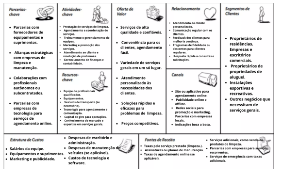

# 2. Descrição do Projeto

## 2.1 Visão Geral do Projeto

O projeto se concretiza através de um aplicativo que irá facilitar o acesso dos clientes a serviços de diaristas, babás e eletricistas, com o diferencial de contratar o serviço pelo telefone, com o sistema de avaliação do prestador do serviço, assinatura online do contrato de confiabilidade e a garantia de que o serviço contratado será realizado através de um contrato de fidelidade assinado pelo prestador do serviço também digitalmente.

### 2.1.1 Canvas do Projeto

## 2.2 Stakeholders

- João Augusto - [Gestor do projeto/desenvolvedor]
- Juliane Padilha - [desenvolvedora/Product Owner]
- Luiz Fernando - [desenvolvedor]
- Fernando Seabra - [gestor de marketing]
- Lucas Meurer - [gestor de marketing]

## 2.3 Objetivos

**Objetivo Específico:** Desenvolver um aplicativo móvel que conecte diaristas a clientes em busca de serviços de limpeza.  
**Mensurável:** Registrar pelo menos 200 downloads do aplicativo nos primeiros dois meses após o lançamento.  
**Alcançável:** Utilizar recursos financeiros disponíveis e uma equipe de desenvolvimento qualificada.  
**Relevante:** Atender à demanda crescente por serviços de limpeza confiáveis e convenientes.  
**Temporal:*