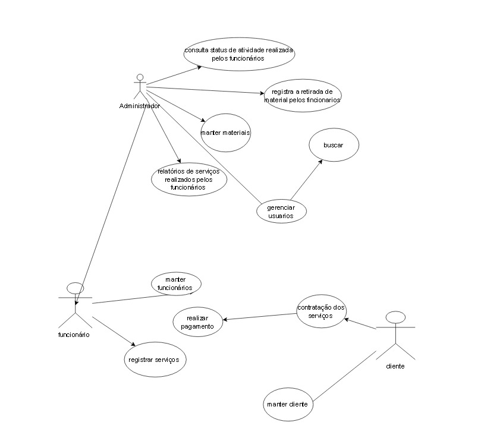

# 4. Diagrama de Caso de Uso

## 4.1 Descrição de Caso de Uso

#### Fluxo

**Cenário:** Consulta de Status de Atividade

**Objetivo:** Consultar o status de atividade dos prestadores de serviço e, se necessário, remover algum do sistema.

**Atores:** Administrador

**Pré-Condição:**
 O administrador possui credenciais válidas e deve estar logado. E devem existir prestadores de serviço cadastrados no sistema.

**Fluxo de Eventos:**
1. O administrador faz login no sistema.
2. Após o login, o administrador seleciona a opção de "Consulta de Status de Atividade" na interface do sistema.
3. O sistema exibe uma lista de funcionários/prestadores de serviço com seus respectivos status de atividade.
4. O status pode incluir informações como "Ativo", "Inativo", "Em Pausa", etc.
5. Com base nos status de atividade exibidos, o administrador avalia se algum prestador de serviço deve ser removido do sistema.
6. Se necessário, o administrador seleciona o prestador de serviço desejado.
7. O administrador escolhe a opção para remover o prestador de serviço do sistema.
8. O sistema confirma a ação e executa a remoção.

**Cenário:** Contratação de Serviços

**Objetivo:** Permitir que o cliente contrate um funcionário para a execução de um serviço específico.

**Atores:** Cliente, Funcionário/Prestador de Serviço, Administrador

**Pré-Condições:** O cliente deve possuir credenciais válidas para acesso ao sistema e 
devem existir  funcionários/prestadores de serviço cadastrados no sistema.

**Fluxo de Eventos**
1. O cliente faz login no sistema usando suas credenciais.
2. Após o login, o cliente acessa a área de contratação de serviços no sistema.
3. O sistema exibe uma lista de funcionários disponíveis para a contratação de serviços.
4. A lista pode incluir informações relevantes sobre os funcionários, como habilidades, avaliações, disponibilidade, etc.
5. O cliente seleciona um funcionário com base nas informações fornecidas.
6. Pode haver opções para filtrar ou ordenar a lista para facilitar a escolha.
7. O cliente fornece detalhes específicos sobre o serviço a ser contratado, como data, horário, local e requisitos específicos.
8. O sistema exibe um resumo dos detalhes da contratação para revisão do cliente.
9. O cliente confirma a contratação, indicando concordância com os termos e condições.
10. O funcionário selecionado é notificado sobre a contratação e recebe os detalhes do serviço.
11. O sistema atualiza o status da contratação para "Em Andamento" e notifica o cliente sobre a confirmação.